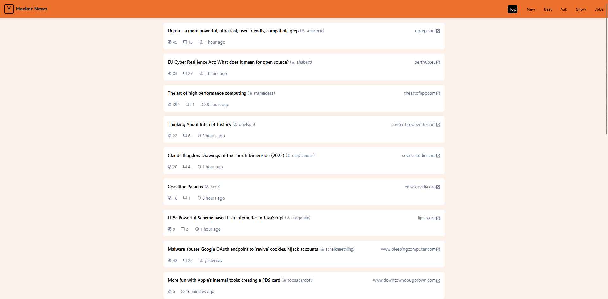
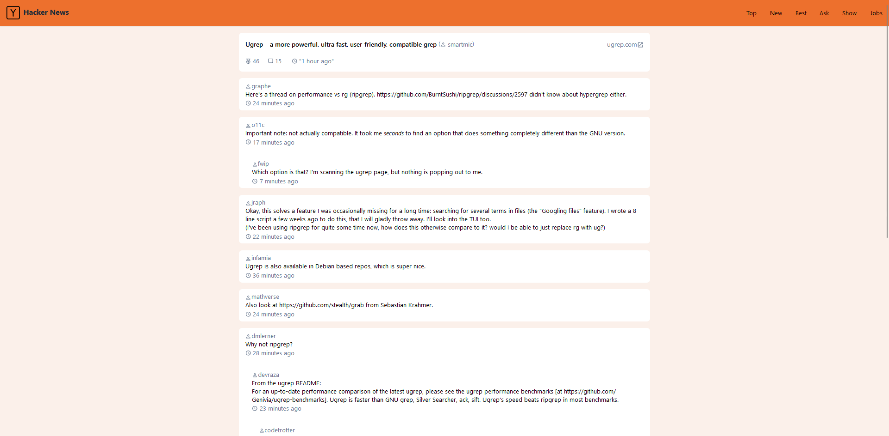

# HackerNews Nuxt 3 App

This Nuxt 3 application fetches and displays news articles from the HackerNews API.

 

## Description

A simple and responsive Nuxt 3 app that allows users to read the latest news articles from HackerNews. The application leverages the HackerNews API to fetch data, providing a clean and user-friendly interface for browsing news content.

## Getting Started

To get started with the app, follow these steps:

```bash
git clone https://github.com/Gebriel/hn-clone.git
cd hn-clone
npm install
npm run dev
